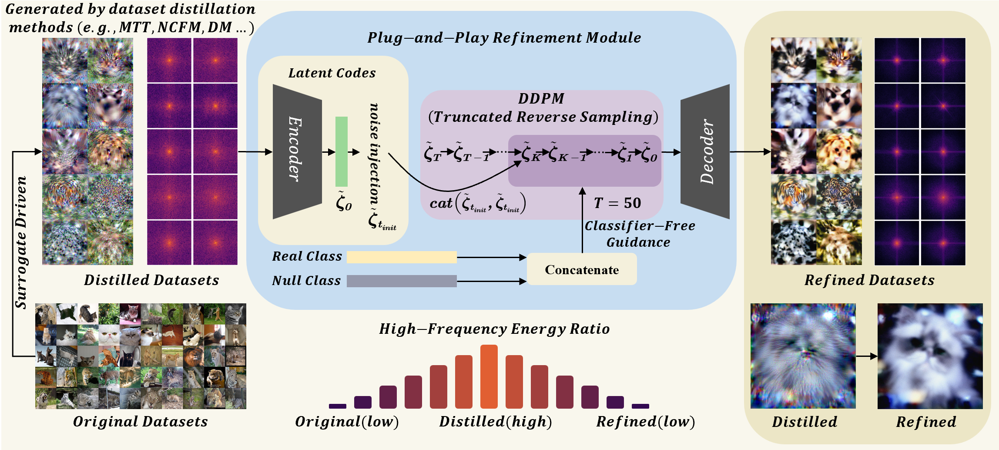

# **📖** PReDD: Post-Distillation Refinement for Dataset Distillation

> Official implementation of the ICASSP 2026 paper:  

> *PReDD: Post-Distillation Refinement for Dataset Distillation*  

> Authors: Zhiyong Shu, Jielei Wang, Qianxin Xia, Zihan Cheng, Heng Yin, Guoming Lu 

> [📄 Paper Link](https://arxiv.org/abs/xxxx.xxxxx) | [🌐 Project Page](https://predd13.github.io/)

<div align="center">
    
</div>


## **🔍** Abstract

Dataset distillation compresses large datasets into compact synthetic subsets for efficient learning. However, existing methods often rely on specific surrogate models, resulting in undesirable high-frequency patterns and limited cross-architecture generalization. To address this issue, we introduce **PReDD**, a training-free and **P**ost-distillation **Re**finement module that improves the quality of **D**istilled Datasets without retraining or modifying the original pipeline. PReDD encodes distilled images into the latent space of a pre-trained VAE and applies a truncated reverse diffusion process to refine them, effectively suppressing surrogate-induced high-frequency patterns while enhancing semantic content. Our method is model-agnostic and compatible with various distillation techniques. Extensive experiments show that PReDD consistently achieves state-of-the-art performance on cross-architecture evaluation, demonstrating superior generalization in dataset distillation. Codes and resources are available at: \url{https://predd13.github.io/}.

## Implementation

### **⚙️** Getting Started

First, create the Conda virtual environment:

```bash
conda env create -f environment.yaml
```

Then, activate the Conda environment:

```bash
source activate predd
```

Before starting, ensure that you have downloaded the DiT checkpoint:

### Downloading Pre-Trained DiT Models

```bash
python download.py
```

This script will download the pre-trained DiT models and place them in the `pretrained_models/` directory.

### Datasets

As a plug-and-play module, we perform **Refinement** on existing distilled datasets. We provide a bash script to generate your own distilled datasets by executing the following in dm_base.sh:

```bash
CUDA_VISIBLE_DEVICES=1 python dm_base.py --dataset=imagenet-fruits --ipc=1 --data_path='/home/user/imagenet' \
    --save_path='./saved_results' --pix_init='noise'
```

This will allow you to modify the parameters to obtain different IPC settings and distilled subsets of the dataset.

Datasets for other methods can be obtained by running their respective code. The repositories for these methods are listed below:

- [MTT](https://github.com/GeorgeCazenavette/mtt-distillation)
- [EDF](https://github.com/NUS-HPC-AI-Lab/EDF)
- [NCFM](https://github.com/gszfwsb/NCFM)

### Quick Evaluation

For quick evaluation, we provide a set of distilled ImageNet-Fruits datasets using the **DM** method for both 1 IPC and 10 IPC, as well as a set of distilled ImageNet-Meow datasets using the **NCFM** method for 1 IPC and 10 IPC. You can obtain the refined datasets by executing the following script:

```bash
#!/bin/bash 
# Parameter settings
MODE="dm"  # Used for save path and distill_type

# GPU device
GPU=0

EXPS=("fruits_10ipc")
DATASETS=("imagenet-fruits")
DISTILL_PATHS=(
    "/root/PreDD/saved_results/dm/imagenet-fruits/10_ipc/res_128_DM_imagenet-fruits_ConvNet_10ipc.pt"
)

# Loop through experiments
for i in "${!EXPS[@]}"; do
    EXP=${EXPS[$i]}
    DATASET=${DATASETS[$i]}
    DISTILL_PATH=${DISTILL_PATHS[$i]}

    # Create save directory
    SAVE_DIR="./sample_results/dit-distillation/${MODE}"

    echo "Launching distillation with:"
    echo "MODE: $MODE"
    echo "DATASET: $DATASET"
    echo "EXP: $EXP"
    echo "GPU: $GPU"
    echo "DISTILL_PATH: $DISTILL_PATH"

    CUDA_VISIBLE_DEVICES=$GPU python predd.py \
        --model DiT-XL/2 \
        --image-size 256 \
        --ckpt pretrained_models/DiT-XL-2-256x256.pt \
        --save-dir "$SAVE_DIR" \
        --exp "$EXP" \
        --dataset "$DATASET" \
        --num-sampling-steps 50 \
        --forward-t 20 \
        --reverse-t 20 \
        --diff-loop 1 \
        --seed 1 \
        --batch-size 1 \
        --saved True \
        --save_origin True \
        --distill-path "$DISTILL_PATH" \
        --distill-type "$MODE" \
        --cfg-scale 4

    echo "Experiment $EXP finished!"
done
```

### Customize Hyperparameters

You can modify the hyperparameters like `forward-t` and `reverse-t`, as well as change `MODE`, `EXPS`, `DATASETS`, and `DISTILL_PATH` to generate the corresponding NCFM refined datasets. The hyperparameter settings for different methods are as follows:

| Method                             | Forward-t / Reverse-t |
| ---------------------------------- | --------------------- |
| **DM** (Zhao et al., 2023)         | 10 / 15               |
| **NCFM** (Wang et al., 2025)       | 25 / 30               |
| **MTT** (Cazenavette et al., 2022) | 10 / 10               |
| **EDF** (Wang et al., 2025)        | 10 / 10               |

### Example for DM Method

To evaluate a refined dataset using the **DM** method with 10 IPC, execute the script with the following settings:

```bash
#!/bin/bash

# Parameter settings
MODE="dm"  # Choose from: ncfm, mtt, dm, ours, random
SAVED="dm"  # Saved path!!
LOG_TYPE="semantic"  # Options: "original" or "semantic"

EXPS=("fruits_10ipc")
DATASETS=("imagenet-fruits")

DISTILL_DIFFUSIONS=(
    "/root/PReDD/sample_results/dit-distillation/dm/imagenet-fruits/fruits_10ipc/imagenet_distill_256_256.pt"
)

# GPU configuration
GPUS=(0)  # GPU index for each task

# Loop through datasets
for i in ${!DATASETS[@]}; do
    DATASET=${DATASETS[$i]}
    EXP=${EXPS[$i]}

    DISTILL_DIFFUSION=${DISTILL_DIFFUSIONS[$i]}

    GPU=${GPUS[$i]}

    # Log path based on MODE
    LOG_DIR="./sample_results/dit-distillation/${SAVED}/${DATASET}/${EXP}"

    LOG_FILE="${LOG_DIR}/log_${LOG_TYPE}.txt"
    mkdir -p "$LOG_DIR"

    echo "Launching: $DATASET / $EXP on GPU $GPU"

    CUDA_VISIBLE_DEVICES=$GPU python evaluate.py \
        --dataset="$DATASET" \
        --data_path="/root/autodl-tmp/imagenet" \
        --distill_path="$DISTILL_DIFFUSION" \
        --test_type="$MODE" \
        --depth=5 \
        --width=128 \
        > "$LOG_FILE" &  # Run in background
done

wait

echo "All parallel experiments finished."
```

### Our Results


## Acknowledgements

This project is primarily developed based on the following works:

- [IGD](https://github.com/mchen725/DD_IGD)
- [DiT](https://github.com/facebookresearch/DiT)
- [MTT](https://github.com/GeorgeCazenavette/mtt-distillation)
- [EDF](https://github.com/NUS-HPC-AI-Lab/EDF)
- [NCFM](https://github.com/gszfwsb/NCFM)

